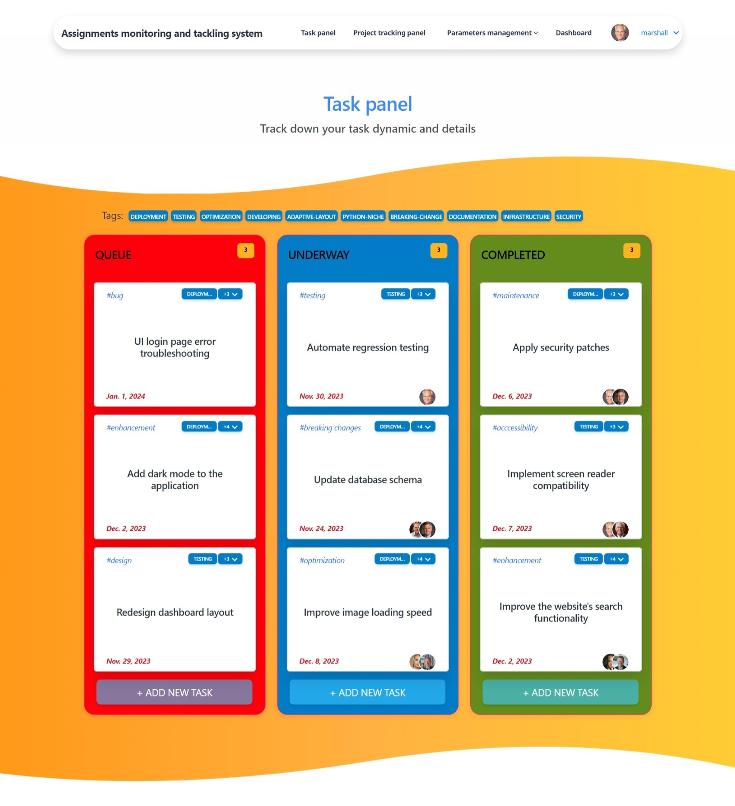
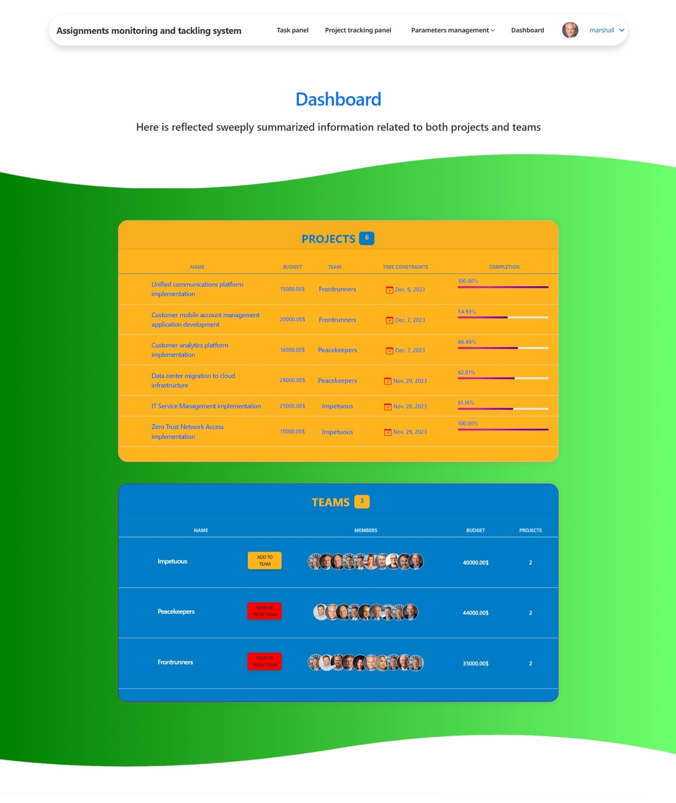
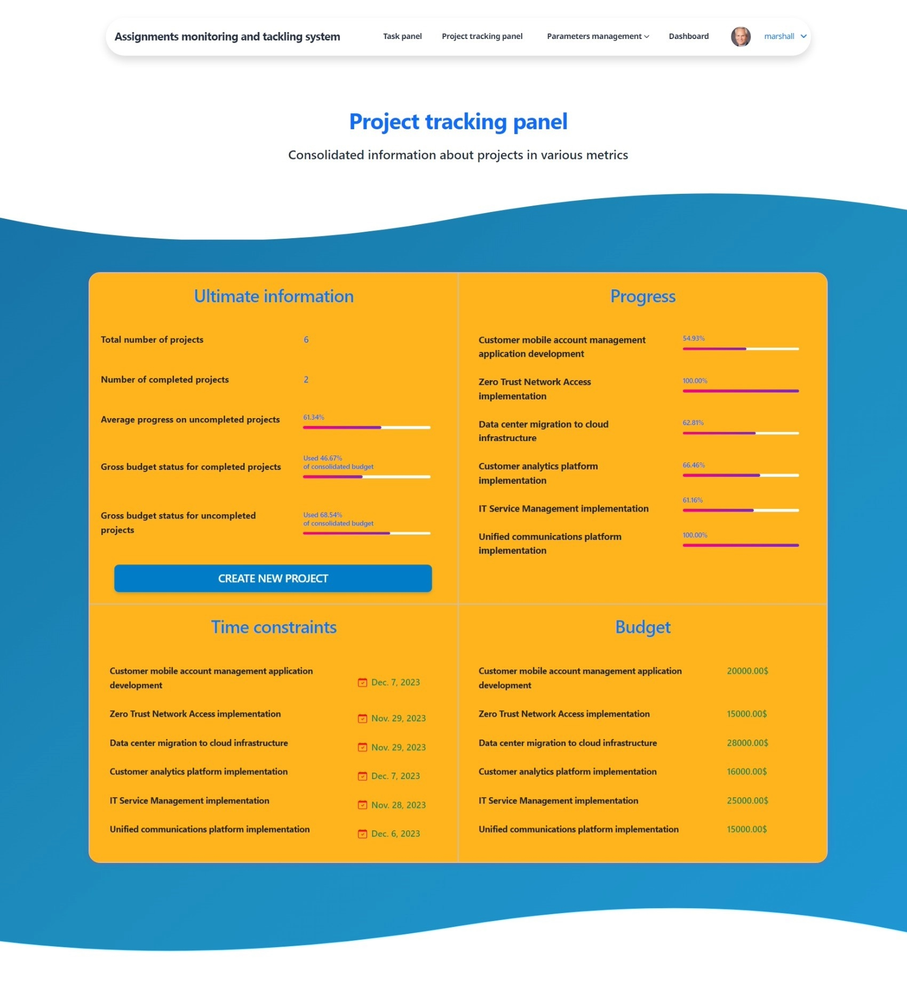

# Assignments monitoring and tackling system

Here's my personally developed website to assist you and your team in streamlining work management!

This venue places at your disposal efficient means for regimented maintaining of both standalone tasks and compound assignments (projects).
You are able to resolve tasks individually using task panel. You might as well collaborate along with other workers in tackling projects.
Tags allow you to navigate assignments faster.

## Installation

Python3 must be already installed

```shell
git clone https://github.com/callogan/workflow_organizer.git
cd workflow_organizer
python3 -m venv venv
venv\Scripts\activate
pip install -r requirements.txt
python manage.py runserver
```

## Features

* Functionality related to user authentication
* Ability to create teams and projects
* Maintaining your Task panel and Project tracking panel
* Sorting assignments by tags

## Demo




